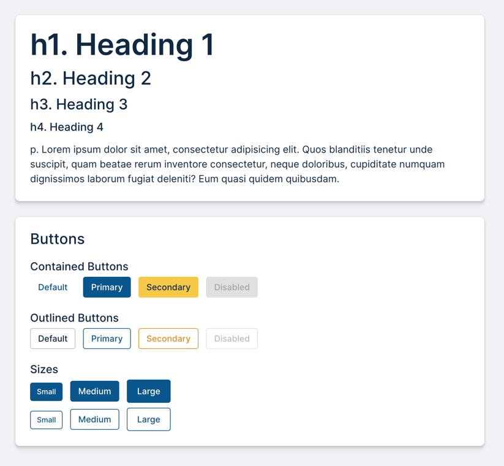
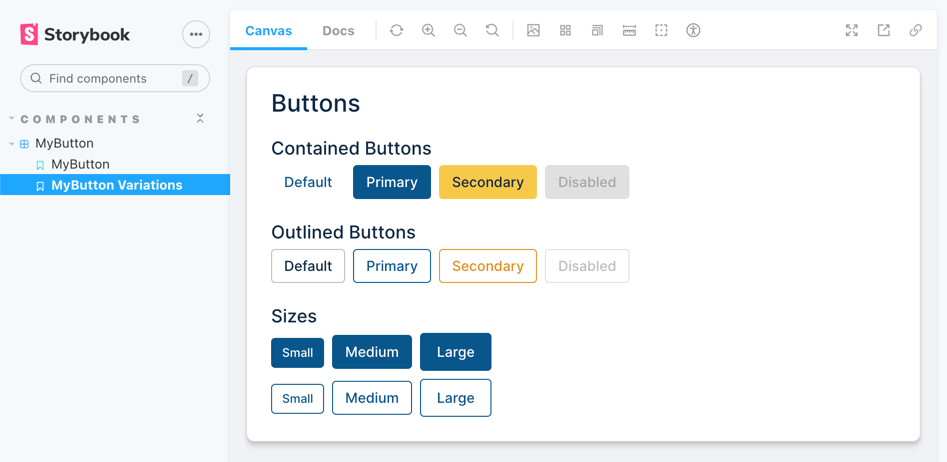

# Stencil Demo

An example of using Stencil to create a component library.

## Building the Stencil Library

```shell
npm install

# Run the stencil-library in the browser (http://localhost:3333)
npm run dev
```

Point your browser to http://localhost:3333. You should see the following page:



## Building the React Wrappers

```shell
npm run build
npm run storybook
```

You should see the button component running in Storybook:


